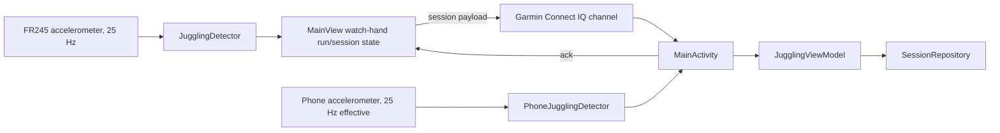

# JugglingTracker

Two-platform juggling tracker focused on a single counting hand. A Garmin Forerunner 245 watch app counts watch-hand catches from accelerometer data, stores runs for the active watch session, and sends finished sessions to an Android companion app for storage, charts, CSV export, and developer-only algorithm recording workflows. The Android app can also record sessions directly from the phone accelerometer when the phone is held in the counting hand. Counts are not both-hands totals.

## Project Structure

- `connectiq/` - Garmin Connect IQ watch app in Monkey C.
  - `source/JugglingTrackerApp.mc` - app entry point.
  - `source/ModeSelectView.mc` - developer-only chooser for normal tracking vs recording mode, hidden in customer startup.
  - `source/BallSelectView.mc` - choose 3-9 balls before a run.
  - `source/JugglingDetector.mc` - watch-hand catch detection algorithm.
  - `source/MainView.mc` - normal tracking UI, sensor listener, session sync.
  - `source/RecordingView.mc` - developer-only raw accelerometer capture and labeling mode.
  - `manifest.xml`, `monkey.jungle`, `resources/` - Connect IQ configuration and assets.
- `android/` - Android companion app in Kotlin and Jetpack Compose.
  - `MainActivity.kt` - Garmin Connect IQ SDK integration, permissions, message routing.
  - `logic/JugglingViewModel.kt` - UI/session state, imports, CSV export, voice events.
  - `logic/PhoneJugglingDetector.kt` - phone IMU detector mirroring the watch catch-detection state machine.
  - `data/SessionRepository.kt` - SharedPreferences persistence for finished sessions.
  - `data/RecordingRepository.kt` - raw recording CSV persistence/export.
  - `ui/` - Compose screens, session cards, charts, tracker/settings UI.
  - `model/` - session/run data classes.
- `connectiq/data/` - labeled accelerometer recordings used to tune and verify detection, one run per file named `YYYYMMDD_HHMMSS.csv`.
- `simulation/` - Python analysis, plotting, tuning, and regression tests.

## How It Works



  The watch is the session controller for Garmin sessions. The phone listens, stores the received watch-hand catch counts and session duration, and sends an `ack`; the watch only exits after receiving that acknowledgement or after the user explicitly quits without syncing. Phone IMU sessions are controlled entirely in the Android app and are saved through the same session repository.

### Watch Detection

`JugglingDetector` processes milli-g accelerometer samples at 25 Hz:

1. Convert to m/s².
2. Estimate gravity with a low-pass filter (`0.95` idle, `0.99` during active juggling).
3. Subtract gravity and use linear acceleration magnitude.
4. Apply a causal 2nd-order Butterworth highpass filter at 0.7 Hz.
5. Treat threshold crossings as candidate events.
6. Delay and merge nearby candidates into one catch-motion burst.
7. Count odd-numbered committed bursts as catches by the watch-wearing hand and skip the alternating other-hand bursts.

Current burst-clustering parameters:

| Balls | HP threshold | Candidate refractory | Raw gate | Merge window |
| --- | ---: | ---: | ---: | ---: |
| 3 | 2.0 | 80 ms | 7.0 m/s² | 160 ms |
| 4 | 3.0 | 80 ms | 11.0 m/s² | 160 ms |
| 5-6 | 3.0 | 40 ms | 13.0 m/s² | 160 ms |
| 7+ | 3.0 | 160 ms | 7.0 m/s² | 80 ms |

7+ has its own bucket because its cadence is distinctly faster than 5-ball, and it was previously run on parameters fitted entirely to 5-ball data.

The Python simulator in `simulation/eval_new_watch.py` mirrors the watch detector. Keep it, `connectiq/source/JugglingDetector.mc`, `simulation/test_detection.py`, and `.github/instructions/connectiq-monkeyc.instructions.md` in sync when changing detector behavior or parameters.

### Phone IMU Sessions

The tracker screen has a phone button next to the Garmin status. It opens a full-screen phone tracker where the user selects the ball count, starts recording, juggles while holding the phone in the counting hand, then saves the finished session. The Android detector mirrors the watch burst-clustering/counting algorithm and processes phone accelerometer samples at an effective 25 Hz so the stored `runs`, `durationSeconds`, and `runDurationsMillis` match the watch session shape.

Phone sessions are stored in the same `SessionSummary` history as watch sessions. There is intentionally no separate source field in storage, so graphs and CSV export treat watch and phone sessions seamlessly.

### Recording Mode

**Recording mode ships enabled, deliberately.** It is how the labeled corpus grows: users capture runs, send them back through the Android app, and those recordings become the data every detector test runs against. The Connect IQ store description in `connectiq/PUBLISHING.md` advertises it as a feature.

Setting `ENABLE_RECORDING_MODE` to `false` in `connectiq/source/JugglingTrackerApp.mc` skips the mode picker and starts users directly on ball selection. `test_detection.py::test_watch_startup_offers_recording_mode` pins the current value, so flipping it fails that test and forces the change to be deliberate. See requirement APP-1.

> Earlier revisions of this file claimed the flag had to be turned off before release. That was wrong — it contradicted both the store listing and the test — and disabling it would have removed an advertised feature. Watch app 1.1.0 shipped with it on.

Controls, once a ball count is chosen:

- **Start** begins a run; **Start** again stops it. Runs are capped at 120 seconds, and end early if free memory runs low.
- On the labeling screen, **Up/Down** adjust the detected count to the true watch-hand count, **Start** confirms and transmits, **Back** discards the run after a confirmation.
- **Back** anywhere else offers to quit the app.

A confirmed run transfers in chunks of 50 samples: a `rec_start` header, one `rec_chunk` per batch, then `rec_end`, which the phone acknowledges once it has written the file. A failed transfer offers retry, skip, or quit. The Android app writes each run through `RecordingRepository` in the same format as `connectiq/data/`, so files can be copied straight into the corpus.

One run per file, named by its run id, starting with a metadata header:

```csv
# run=20260923_223144,timestamp=1790195504,balls=5,catches=94,sampleRate=25,units=milli_g,source=watch,countMode=watch_hand,detectedAtCapture=93
x,y,z
...
```

`catches` is the ground-truth label. `detectedAtCapture` is what the detector counted when the run was recorded — a historical result, not a property of the measurement, so it goes stale whenever the detector changes. `source` is `watch` (25 Hz) or `phone` (200 Hz).

## Communication Payloads

Finished sessions:

```json
{ "type": "session", "countMode": "watch_hand", "balls": 3, "timestamp": 1780511578, "durationSeconds": 742, "runDurationsMillis": [8200, 5100, 10400], "runs": [17, 11, 21] }
```

Raw recordings, sent as a header, then one message per chunk of 50 samples, then an end marker:

```json
{ "type": "rec_start", "id": 1790195504, "countMode": "watch_hand", "balls": 5, "catches": 94, "detected": 93, "sampleRate": 25, "samples": 1500, "chunks": 30, "timestamp": 1790195504 }
{ "type": "rec_chunk", "id": 1790195504, "i": 0, "x": [], "y": [], "z": [] }
{ "type": "rec_end", "id": 1790195504 }
```

Only `session` and `rec_end` are acknowledged. Chunks are not, because the watch advances on delivery — a duplicate chunk is ignored, but a gap aborts the run rather than writing corrupt training data.

Acknowledgement from phone to watch:

```json
{ "type": "ack", "timestamp": 1780511578 }
```

## Build And Test

### Android

Requires JDK 17+. Android Studio's bundled JBR works.

```sh
cd android
./gradlew assembleDebug       # build debug APK
./gradlew test                # unit tests
./gradlew installDebug        # install on connected phone
```

### Garmin Watch

The watch app's behaviour is specified in `connectiq/REQUIREMENTS.md`, and the
unit tests in `connectiq/test/` compile and execute the real Monkey C against
it in the simulator:

```sh
cd connectiq
./run_tests.sh                # all tests on fr245
./run_tests.sh fenix6xpro     # or any other supported device
```

Every requirement names the test that secures it, and `test_detection.py`
fails if a requirement cites a test that no longer exists or if a watch unit
test is not claimed by any requirement — so the spec cannot drift from the
tests unnoticed.

### Detection Simulation

Run from the repository root or from `simulation/`:

```sh
cd simulation
python -m pytest test_detection.py -v
python eval_new_watch.py
```

`test_detection.py` locks the labeled-data detector baseline: 189 total absolute error and 69 total overcount error across 102 labeled runs / 2459 watch-hand catches. Every recording in `connectiq/data/` must have an entry in `EXPECTED_RUNS`, so adding data means adding its expected count there too.

Per-ball-count accuracy on that corpus:

| Balls | Runs | Catches | Absolute error |
| --- | ---: | ---: | ---: |
| 3 | 14 | 343 | 16 |
| 4 | 13 | 291 | 11 |
| 5-6 | 32 | 966 | 104 |
| 7+ | 18 | 205 | 26 |

### Connect IQ Watch App

Requires the Garmin Connect IQ SDK and a developer signing key at `connectiq/developer_key.der`.

```sh
monkeyc -f connectiq/monkey.jungle -d fr245 \
    -o connectiq/build/JugglingTracker.prg \
    -y connectiq/developer_key.der -r
```

A Windows SDK install can also be invoked with the full `monkeyc.bat` path if `monkeyc` is not on `PATH`.

Run in the simulator:

```sh
connectiq
monkeydo connectiq/build/JugglingTracker.prg fr245
```

Install on a real watch over USB by copying the built app to the mounted device. On macOS:

```sh
cp connectiq/build/JugglingTracker.prg /Volumes/GARMIN/GARMIN/Apps/JugglingTracker.prg
diskutil eject GARMIN
```

On Windows:

```powershell
Copy-Item connectiq\build\JugglingTracker.prg D:\GARMIN\APPS\JugglingTracker.prg -Force
```

Use the actual drive letter for the mounted Garmin volume, then safely eject the device before unplugging.

### Debugging A Watch Crash

When a watch app dies, the device shows the Connect IQ logo and writes the unhandled exception to `GARMIN/Apps/LOGS/CIQ_LOG.YML` on the watch's USB volume, with the previous log rotated to `CIQ_LOG.BAK`. The entries carry raw program counters rather than symbols:

```yaml
Error: Unhandled Exception
Stack:
  - pc: 0x10003c1e
```

Resolve them against the `.prg.debug.xml` produced alongside the build the watch was running — confirm it is the right one by comparing the `.prg` md5 with the copy on the device, since addresses shift with any code change. The `pcToLineNum` entries map each pc to a file, line and symbol; take the entry with the largest pc not exceeding the crash pc. The simulator cannot stand in for this: it delivers no data to `registerSensorDataListener` without a GUI-loaded data source, so sensor-path faults do not reproduce there.

## End-To-End Use

1. Pair the Forerunner 245 with the phone in Garmin Connect.
2. Install the Connect IQ watch app on the watch.
3. Install and open the Android app; grant Bluetooth permissions.
4. Start the watch app, choose the ball count, and juggle normally.
5. Stop from the watch menu and choose sync when finished.

Alternatively, open the Android app, tap the phone button next to the Garmin status, choose the ball count, start recording, and save when finished. Hold the phone in the counting hand for phone IMU sessions.

## Security Note

Connect IQ developer signing keys such as `developer_key.der` and private-key variants are local secrets. They are gitignored and must not be committed. If a key is ever exposed, rotate it and re-sign the app.
