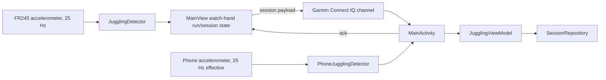

# JugglingTracker

Two-platform juggling tracker focused on a single counting hand. A Garmin Forerunner 245 watch app counts watch-hand catches from accelerometer data, stores runs for the active watch session, and sends finished sessions to an Android companion app for storage, charts, CSV export, and developer-only algorithm recording workflows. The Android app can also record sessions directly from the phone accelerometer when the phone is held in the counting hand. Counts are not both-hands totals.

## Project Structure

- `connectiq/` - Garmin Connect IQ watch app in Monkey C.
  - `source/JugglingTrackerApp.mc` - app entry point.
  - `source/ModeSelectView.mc` - developer-only chooser for normal tracking vs recording mode, hidden in customer startup.
  - `source/BallSelectView.mc` - choose 3-9 balls before a run.
  - `source/JugglingDetector.mc` - watch-hand catch detection algorithm.
  - `source/MainView.mc` - normal tracking UI, sensor listener, session sync.
  - `source/RecordingView.mc` - developer-only raw accelerometer capture and labeling mode.
  - `manifest.xml`, `monkey.jungle`, `resources/` - Connect IQ configuration and assets.
- `android/` - Android companion app in Kotlin and Jetpack Compose.
  - `MainActivity.kt` - Garmin Connect IQ SDK integration, permissions, message routing.
  - `logic/JugglingViewModel.kt` - UI/session state, imports, CSV export, voice events.
  - `logic/PhoneJugglingDetector.kt` - phone IMU detector mirroring the watch catch-detection state machine.
  - `data/SessionRepository.kt` - SharedPreferences persistence for finished sessions.
  - `data/RecordingRepository.kt` - raw recording CSV persistence/export.
  - `ui/` - Compose screens, session cards, charts, tracker/settings UI.
  - `model/` - session/run data classes.
- `data/` - labeled accelerometer recordings used to tune and verify detection.
- `simulation/` - Python analysis, plotting, tuning, and regression tests.

## How It Works



  The watch is the session controller for Garmin sessions. The phone listens, stores the received watch-hand catch counts and session duration, and sends an `ack`; the watch only exits after receiving that acknowledgement or after the user explicitly quits without syncing. Phone IMU sessions are controlled entirely in the Android app and are saved through the same session repository.

### Watch Detection

`JugglingDetector` processes milli-g accelerometer samples at 25 Hz:

1. Convert to m/s².
2. Estimate gravity with a low-pass filter (`0.95` idle, `0.99` during active juggling).
3. Subtract gravity and use linear acceleration magnitude.
4. Apply a causal 2nd-order Butterworth highpass filter at 0.7 Hz.
5. Treat threshold crossings as candidate events.
6. Delay and merge nearby candidates into one catch-motion burst.
7. Count odd-numbered committed bursts as catches by the watch-wearing hand and skip the alternating other-hand bursts.

Current burst-clustering parameters:

| Balls | HP threshold | Candidate refractory | Raw gate | Merge window |
| --- | ---: | ---: | ---: | ---: |
| 3 | 2.0 | 80 ms | 7.0 m/s² | 160 ms |
| 4 | 4.0 | 40 ms | disabled | 80 ms |
| 5+ | 0.8 | 320 ms | 13.0 m/s² | 160 ms |

The Python simulator in `simulation/eval_new_watch.py` mirrors the watch detector. Keep it, `connectiq/source/JugglingDetector.mc`, `simulation/test_detection.py`, and `.github/instructions/connectiq-monkeyc.instructions.md` in sync when changing detector behavior or parameters.

### Phone IMU Sessions

The tracker screen has a phone button next to the Garmin status. It opens a full-screen phone tracker where the user selects the ball count, starts recording, juggles while holding the phone in the counting hand, then saves the finished session. The Android detector mirrors the watch burst-clustering/counting algorithm and processes phone accelerometer samples at an effective 25 Hz so the stored `runs`, `durationSeconds`, and `runDurationsMillis` match the watch session shape.

Phone sessions are stored in the same `SessionSummary` history as watch sessions. There is intentionally no separate source field in storage, so graphs and CSV export treat watch and phone sessions seamlessly.

### Recording Mode

Recording mode is retained for detector tuning but hidden from customer watch startup while `ENABLE_RECORDING_MODE` is `false` in `connectiq/source/JugglingTrackerApp.mc`. When enabled for development, it captures raw accelerometer samples on the watch. Press Back to start a run, press Back again to stop it, then enter the actual watch-hand catch count. The watch sends a `recording` payload to the phone, and the Android app stores each recording as CSV through `RecordingRepository` so it can be exported for tuning in `simulation/`.

The labeled CSV format starts each run with metadata:

```csv
# balls=3,catches=17,detected=17,sampleRate=25,timestamp=1780511578,countMode=watch_hand
x,y,z
...
```

## Communication Payloads

Finished sessions:

```json
{ "type": "session", "countMode": "watch_hand", "balls": 3, "timestamp": 1780511578, "durationSeconds": 742, "runDurationsMillis": [8200, 5100, 10400], "runs": [17, 11, 21] }
```

Raw recordings:

```json
{
  "type": "recording",
  "countMode": "watch_hand",
  "balls": 3,
  "catches": 17,
  "detected": 17,
  "sampleRate": 25,
  "accelX": [],
  "accelY": [],
  "accelZ": [],
  "timestamp": 1780511578
}
```

Acknowledgement from phone to watch:

```json
{ "type": "ack", "timestamp": 1780511578 }
```

## Build And Test

### Android

Requires JDK 17+. Android Studio's bundled JBR works.

```sh
cd android
./gradlew assembleDebug       # build debug APK
./gradlew test                # unit tests
./gradlew installDebug        # install on connected phone
```

### Detection Simulation

Run from the repository root or from `simulation/`:

```sh
cd simulation
python -m pytest test_detection.py -v
python eval_new_watch.py
```

`test_detection.py` locks the labeled-data detector baseline. The current watch-hand delayed burst-clustering baseline is 55 total absolute error and 5 total overcount error across 36 labeled runs / 483 watch-hand catches.

### Connect IQ Watch App

Requires the Garmin Connect IQ SDK and a developer signing key at `connectiq/developer_key.der`.

```sh
monkeyc -f connectiq/monkey.jungle -d fr245 \
    -o connectiq/build/JugglingTracker.prg \
    -y connectiq/developer_key.der -r
```

A Windows SDK install can also be invoked with the full `monkeyc.bat` path if `monkeyc` is not on `PATH`.

Run in the simulator:

```sh
connectiq
monkeydo connectiq/build/JugglingTracker.prg fr245
```

Install on a real watch over USB by copying the built app to the mounted device:

```powershell
Copy-Item connectiq\build\JugglingTracker.prg D:\GARMIN\APPS\JugglingTracker.prg -Force
```

Use the actual drive letter for the mounted Garmin volume, then safely eject the device before unplugging.

## End-To-End Use

1. Pair the Forerunner 245 with the phone in Garmin Connect.
2. Install the Connect IQ watch app on the watch.
3. Install and open the Android app; grant Bluetooth permissions.
4. Start the watch app, choose the ball count, and juggle normally.
5. Stop from the watch menu and choose sync when finished.

Alternatively, open the Android app, tap the phone button next to the Garmin status, choose the ball count, start recording, and save when finished. Hold the phone in the counting hand for phone IMU sessions.

## Security Note

Connect IQ developer signing keys such as `developer_key.der` and private-key variants are local secrets. They are gitignored and must not be committed. If a key is ever exposed, rotate it and re-sign the app.
