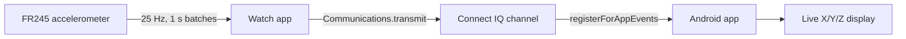

# JugglingTracker IMU Stream

Stream accelerometer data from a Garmin Forerunner 245 watch to an Android
phone in real time and visualize it. The watch app reads the onboard
accelerometer and transmits batched samples over the Connect IQ messaging
channel; the Android companion app receives the samples and displays the live
X/Y/Z values.

## Project structure

- `connectiq/` — Garmin Connect IQ watch app (Monkey C)
  - `manifest.xml` — app manifest (app id, target products, permissions)
  - `monkey.jungle`, `project.xml` — build/project configuration
  - `source/JugglingTrackerApp.mc` — watch app implementation
  - `resources/` — strings, images, and resource definitions
- `android/` — Android companion app (Kotlin)
  - `app/src/main/java/com/jugglingtracker/imu/MainActivity.kt` — Connect IQ
    integration, permissions, and live data UI
  - `app/src/main/AndroidManifest.xml` — Bluetooth permissions
  - `app/src/main/res/layout/activity_main.xml` — bar/value display layout
  - Gradle wrapper and build files

## How it works



### Watch app (`connectiq/source/JugglingTrackerApp.mc`)

- Registers an accelerometer data listener at **25 Hz**, buffering **1 second**
  of samples per callback.
- On each callback, sends a structured payload to the phone:
  `{ "rate": 25, "x": [...], "y": [...], "z": [...] }`.
- Sends one message at a time (skips a batch if the previous transmit is still
  in flight) to avoid overflowing the messaging channel.
- Shows the most recent sample on the watch screen.

App id: `A1B2C3D4E5F60718293A4B5C6D7E8F90` · Targets: `fr245`, `fr245m`.

### Android companion app

- Requests the required Bluetooth permissions (`BLUETOOTH_CONNECT` /
  `BLUETOOTH_SCAN` on Android 12+, `ACCESS_FINE_LOCATION` on older versions).
- Initializes the Garmin Connect IQ Mobile SDK, finds the paired device, and
  registers for app events using the matching watch app id.
- Parses each batch and displays the latest X/Y/Z values as text and bars.

## Building and running

### Watch app

Requires the [Garmin Connect IQ SDK](https://developer.garmin.com/connect-iq/)
and a developer signing key (`developer_key.der`).

```sh
SDK="$HOME/Library/Application Support/Garmin/ConnectIQ/Sdks/<your-sdk-version>"
"$SDK/bin/monkeyc" -f connectiq/monkey.jungle -d fr245 \
    -o connectiq/build/JugglingTracker.prg -y developer_key.der -r
```

Run in the simulator:

```sh
"$SDK/bin/connectiq"                                      # launch simulator
"$SDK/bin/monkeydo" connectiq/build/JugglingTracker.prg fr245
```

> The simulator's accelerometer needs a FIT data file for playback
> (Simulation -> Data Playback). On a real device the live sensor is used.

To install on a real watch, copy the built `.prg` to the device's
`GARMIN/Apps/` folder over USB, or sideload via the Connect IQ tools.

### Android app

Requires Android Studio with a JDK 17+ (the bundled JBR works). Open the
`android/` folder in Android Studio and run, or build from the command line:

```sh
cd android
./gradlew assembleDebug          # APK in app/build/outputs/apk/debug/
```

Install on a connected phone:

```sh
./gradlew installDebug
```

### End-to-end

1. Pair the Forerunner 245 with the phone via the Garmin Connect app.
2. Install and start the watch app on the FR245.
3. Launch the Android app and grant Bluetooth permissions.
4. The phone connects to the watch and shows live accelerometer values.

## Security note

The Connect IQ `developer_key.der` / `.pem` are private signing keys. They are
gitignored and must **never** be committed. If a key is ever exposed, rotate it
and re-sign the app.
