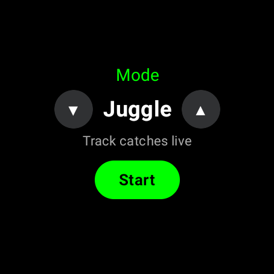
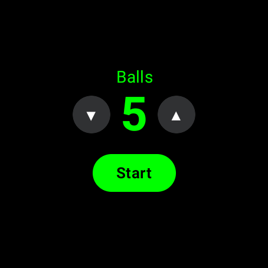
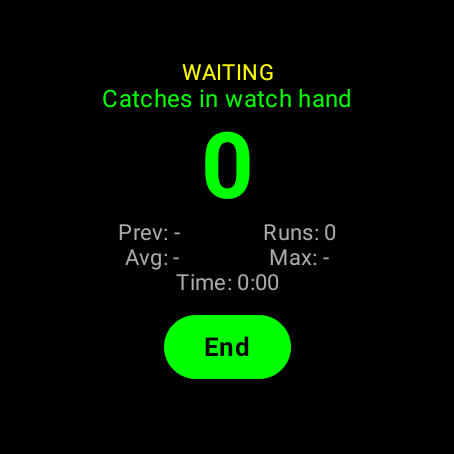
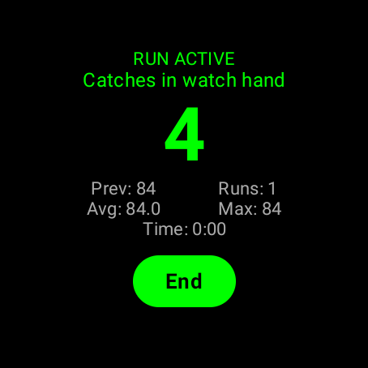
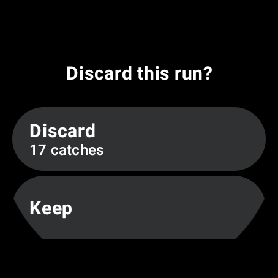
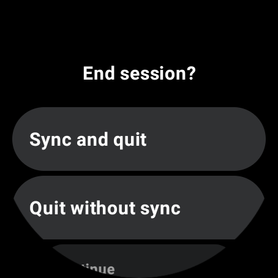
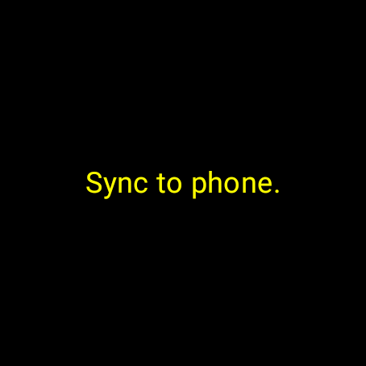
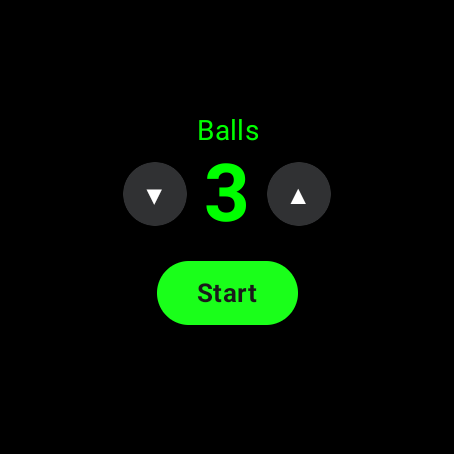
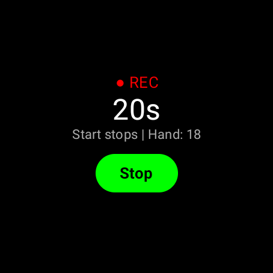
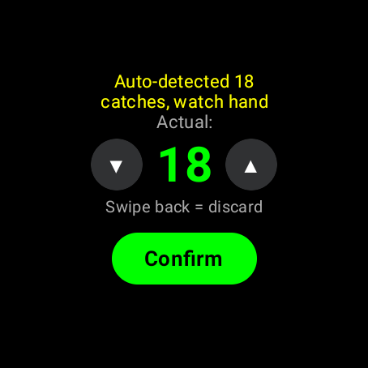

# Wear OS watch app

A Wear OS port of the Garmin Connect IQ app in `../connectiq`. It behaves the
same way: the same screens, the same catch detector, the same session and
recording rules, and the same messages to the phone app in `../android`.
`../connectiq/REQUIREMENTS.md` is the specification for both watches; the
table below says which test covers each requirement here.

## Layout

- `app/src/main/java/com/juggling/tracker/wear/`
  - `logic/` - everything with behaviour, in plain Kotlin with no Android
    types, so it runs as ordinary JVM tests:
    - `JugglingDetector.kt` - line-for-line port of `JugglingDetector.mc`.
    - `ShapeConsistency.kt` - port of `ShapeConsistency.mc`, the Regularity score.
    - `TrackerSession.kt` - Juggle mode (`MainView.mc`): runs, menus, sync.
    - `RecordingSession.kt` - Record mode (`RecordingView.mc`).
    - `AppNavigator.kt` - mode and ball selection, and button routing.
    - `WatchProtocol.kt` - Data Layer paths and the JSON payload codec.
    - `SampleThrottle.kt` - thins the sensor stream to 25 Hz on a fixed 40 ms grid.
    - `Format.kt` - display strings, identical to what the Garmin draws.
    - `Platform.kt` - the interfaces the sessions use for timers, the clock,
      the phone link and vibration, so tests can fake them.
  - `platform/` - the accelerometer, the Data Layer link, timers, vibration.
  - `ui/` - Compose for Wear OS screens.
  - `MainActivity.kt` - wires it together.

## Buttons

A Garmin has four buttons; a Wear OS watch has a touchscreen and a crown.

| Garmin | Wear OS |
|---|---|
| UP / DOWN | rotate the crown or bezel, or tap ▲ / ▼ |
| START / STOP | the green button on screen (Start, End, Stop, Confirm), or a stem button |
| BACK | swipe right from the left edge, or the back key |

The system's own swipe-to-dismiss is turned off in the theme, because it
would close the app and lose the session. The app recognises the swipe itself
and treats it as BACK, so on the tracking screens a swipe opens the discard
prompt exactly as BACK does on the Garmin (JUG-3, JUG-4).

## Talking to the phone

Sessions and recordings go to the phone over the Wear OS Data Layer as the
same dictionaries the Garmin sends (`session`, `rec_start`, `rec_chunk`,
`rec_end`), encoded as JSON, and the phone answers with the same `ack`. The
phone app registers a Data Layer listener next to its Garmin one and routes
both into the same import code.

In the phone app, Settings > Watch picks Garmin or Wear OS. With Wear OS
picked, the watch card on the home screen is green when a connected watch has
this app, and red otherwise; tapping the red card shows how to connect.

The phone app has to be open to receive. If it is not, the message still
leaves the watch but no ack comes back, and the sync times out after 10 s and
offers a retry, as on the Garmin.

The Data Layer only connects apps that share a package name and signing key,
so this app's `applicationId` is `com.juggling.tracker`, like the phone app,
and release builds must be signed with the same key.

## Screenshots

`screenshots/` holds the emulator screenshots (454×454, API 30, large round)
used for the Wear OS store listing on Google Play. They are copies of the
`wear-emulator-screenshots` artifact that CI uploads on every run; to refresh
them, download that artifact from a green run and replace the files.

| | |
|---|---|
|  Choose Juggle or Record |  Choose the ball count |
|  Waiting for a run |  Run in progress |
|  Discard a run |  End the session |
|  Sync to the phone |  Record mode: ball count |
|  Recording |  Enter the real count |

## Build and test

```sh
cd wearos
./gradlew assembleDebug             # build
./gradlew testDebugUnitTest         # logic tests + Compose UI tests (Robolectric)
./gradlew connectedDebugAndroidTest # on a Wear OS emulator or watch
```

CI runs all three, the last on a Wear OS emulator (API 30, large round), and
uploads screenshots of each step as the `wear-emulator-screenshots` artifact.

## Requirement coverage

`logic/` tests live in `app/src/test/.../logic`, the Robolectric UI tests in
`app/src/test/.../ui/WearAppTest.kt`, and the emulator tests in
`app/src/androidTest`.

| Requirement | Wear OS test |
|---|---|
| APP-1..5 | `AppNavigatorTest`, `WearAppTest`, `WearAppEmulatorTest.startUpFlowLeadsToTheTracker` |
| DET-1..10 | `JugglingDetectorTest` (the Garmin `DetectorTest.mc` cases, same inputs) |
| DET-11 | `DetectorCorpusTest`: every recording in `connectiq/data` gives exactly the count pinned in `simulation/test_detection.py` |
| RUN-1..6 | `JugglingDetectorTest` |
| SHAPE-1..4 | `ShapeConsistencyTest` (it replays the four labelled runs in `simulation/regularity_data`), `TrackerSessionTest` for the screen and the session payload |
| JUG-1..8 | `TrackerSessionTest`, `WearAppTest`, `WearAppEmulatorTest` |
| SENS-1, 2 | The sensor runs while a tracking screen is visible and `AccelerometerSource.start()` is idempotent. Menus are drawn in place rather than pushed as views, so they cannot drop the listener; detection still pauses under a menu, as on the Garmin (`TrackerSessionTest`) |
| SENS-3 | Not applicable: Android does not pad sensor batches with nulls |
| SYNC-1..4 | `TrackerSessionTest`, `WearAppTest`, `WearAppEmulatorTest.replayingARealRecordingShowsItsRunsAndSyncsThem` |
| REC-1..11 | `RecordingSessionTest`, `AppNavigatorTest` (REC-11), `WearAppEmulatorTest.recordModeLabelsARun`. REC-2's free-memory check is Garmin-specific (a 128 KB heap); the 3000-sample cap is kept. REC-4 writes the one-line `RUN_DATA` summary to logcat under the tag `JugglingRecording` |
